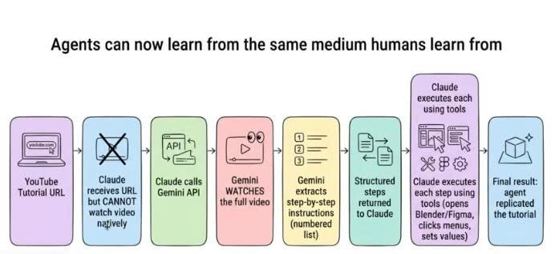

# AI_generate_youtube — AI tự học từ video YouTube và build sản phẩm

## 📌 Tóm tắt dự án

Dự án chứng minh luồng **"Agent học từ chính phương tiện mà con người học"**:

> YouTube URL → Claude (không xem được video) → gọi Gemini API → **Gemini xem toàn bộ video** → trích xuất các bước hành động có cấu trúc → trả về cho Claude → **Claude thực thi từng bước bằng tool** → sản phẩm được tái tạo đúng như video hướng dẫn.



Dự án gồm **2 phần**:

1. **Skill `video-to-action`** (`.claude/skills/video-to-action/`) — nhận YouTube URL, tải video độ phân giải thấp, upload lên Gemini File API để Gemini "xem", và trả về kế hoạch các bước dạng Markdown (Summary / Prerequisites / Steps / Verification).
2. **Sản phẩm HR Agent** — được Claude build hoàn toàn từ kế hoạch mà Gemini trích xuất từ video [AI HR Agent CV Matching](https://youtu.be/7gIwR5SwM_0): hệ thống match CV với việc làm, crawl job từ Google Careers Việt Nam, dùng vector search (ChromaDB) + LangChain agent (`gpt-4o-mini`) để chấm điểm mức độ phù hợp, kèm backend FastAPI (SSE realtime) và frontend Streamlit.

## 🗂 Cấu trúc dự án

```
AI_generate_youtube/
├── .claude/
│   └── skills/
│       └── ai-generate-youtube/
│           ├── SKILL.md                    # Skill trọn vòng đời: xem → kế hoạch → build → verify
│           └── scripts/
│               └── video_to_action.py      # YouTube → Gemini → các bước hành động
├── .agents/                        # Skills của repository-harness
├── docs/                           # Workflow, templates, decisions (harness)
├── image/
│   └── image.png                   # Sơ đồ luồng dự án
├── job_crawls.py                   # Crawl Google Careers VN → ChromaDB
├── hr_agent_format.py              # Pydantic schema cho output của agent
├── hr_agent_tools.py               # Tool search_jobs (vector similarity search)
├── hr_agent.py                     # Agent lõi: LangChain + gpt-4o-mini
├── hr_agent_be.py                  # Backend FastAPI :8000 (SSE /find_jobs)
├── hr_agent_fe.py                  # Frontend Streamlit :8501
├── requirements.txt                # Dependencies cho skill video-to-action
├── setup.txt                       # Dependencies cho sản phẩm HR Agent
└── AGENTS.md                       # Entrypoint của repository-harness
```

Thư mục sinh ra khi chạy (không commit): `chroma_db/` (vector DB), `output/` (kế hoạch trích xuất từ video).

## ⚙️ Hướng dẫn set up

### Yêu cầu

- Python 3.10+ (dự án được kiểm chứng trên 3.12)
- Gemini API key — lấy tại [aistudio.google.com](https://aistudio.google.com) (cho skill video-to-action)
- OpenAI API key — lấy tại [platform.openai.com](https://platform.openai.com) (cho HR Agent)
- `ffmpeg` (tùy chọn — để merge audio+video và chế độ fallback trích frame)

### Cài đặt

```bash
git clone https://github.com/NguyenMinhQuan-2A202601478/AI_generate_youtube.git
cd AI_generate_youtube

# Khuyến nghị: dùng virtual environment (BẮT BUỘC trên macOS với Python
# cài qua Homebrew — pip hệ thống bị chặn theo PEP 668 "externally-managed-environment")
python3 -m venv .venv
source .venv/bin/activate        # macOS/Linux
# .venv\Scripts\Activate.ps1     # Windows PowerShell

# Dependencies cho skill video-to-action
pip install -r requirements.txt

# Dependencies cho sản phẩm HR Agent
pip install -r setup.txt
```

> **Lưu ý macOS**: nếu gặp lỗi `error: externally-managed-environment`, đó là cơ chế
> PEP 668 của Python Homebrew — luôn cài trong venv như trên. Khi dùng với Claude Code,
> kích hoạt venv trước rồi mới mở Claude trong cùng terminal: `source .venv/bin/activate && claude`

### Cấu hình API key

Tạo file `.env` ở thư mục gốc (file này đã được gitignore — **không bao giờ commit key**):

```env
GEMINI_API_KEY=your_gemini_key_here
OPENAI_API_KEY=your_openai_key_here
```

## 🚀 Cách chạy

### 1. Skill ai-generate-youtube (AI học từ video rồi build theo)

Trong Claude Code chỉ cần dán link YouTube và nói "làm theo video này" (hoặc gõ `/ai-generate-youtube <link>`). Chạy script trích xuất thủ công:

```bash
# Phân tích đầy đủ (Gemini xem cả hình và tiếng)
python .claude/skills/ai-generate-youtube/scripts/video_to_action.py "https://youtu.be/VIDEO_ID"

# Chế độ nhanh (chỉ transcript, rẻ hơn)
python .claude/skills/ai-generate-youtube/scripts/video_to_action.py "https://youtu.be/VIDEO_ID" --quick

# Hỏi một câu cụ thể về video
python .claude/skills/ai-generate-youtube/scripts/video_to_action.py "https://youtu.be/VIDEO_ID" --question "Bước 3 tác giả cấu hình gì?"
```

> **Giới hạn môi trường**: skill cần chạy trên máy thật (Claude Code). Sandbox cloud của
> claude.ai chặn cả youtube.com lẫn Gemini API nên không dùng được ở đó. YouTube đôi khi
> chặn lấy transcript theo IP — chế độ full vẫn hoạt động vì Gemini xem trực tiếp video.

Kết quả lưu tại `output/<video_id>_steps.md`.

### 2. Sản phẩm HR Agent (match CV với việc làm)

Chạy lần lượt:

```bash
# Bước 1: Crawl job Google Careers VN và nạp vào vector DB (chạy 1 lần)
python job_crawls.py

# Bước 2 (tùy chọn): Test agent lõi với CV mẫu
python hr_agent.py

# Bước 3: Khởi động backend (giữ terminal này chạy)
python hr_agent_be.py

# Bước 4: Mở terminal mới, khởi động frontend
streamlit run hr_agent_fe.py
```

Sau đó mở **http://localhost:8501**, tải CV (PDF) lên và bấm **"Phân tích & Tìm việc phù hợp"**. Hệ thống sẽ stream tiến trình realtime và trả về top 3 vị trí kèm điểm phù hợp (0–100), điểm mạnh, kỹ năng còn thiếu, gợi ý cải thiện và link ứng tuyển.

Kiểm tra backend: `GET http://localhost:8000/health` → `{"status": "ok", "message": "Hệ thống đang hoạt động bình thường"}`.

## 🔒 Lưu ý bảo mật

- API key chỉ đặt trong `.env` (đã gitignore) — không hardcode, không commit.
- CV người dùng chỉ đi qua backend local → OpenAI API; không lưu trữ ở nơi khác.
